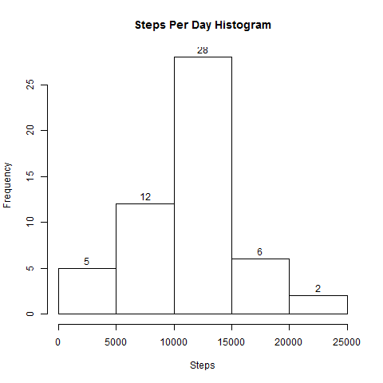
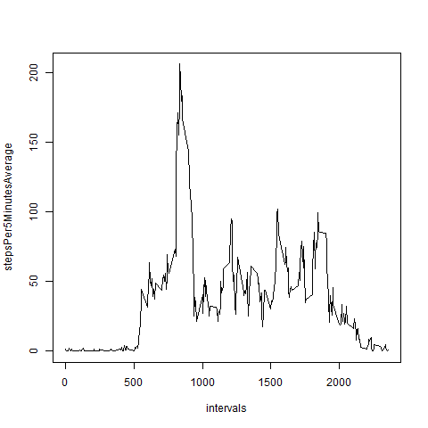
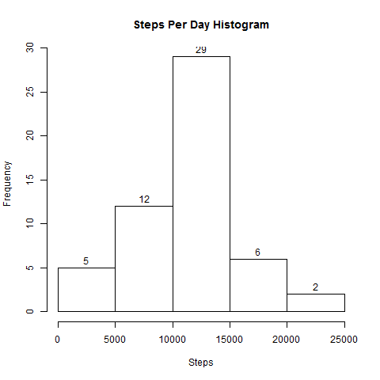
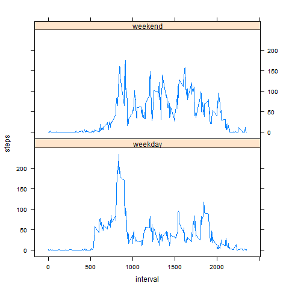

# Reproducible Research: Peer Assessment 1

## Introduction

This assignment makes use of data from a personal activity monitoring
device. This device collects data at 5 minute intervals through out the
day. The data consists of two months of data from an anonymous
individual collected during the months of October and November, 2012
and include the number of steps taken in 5 minute intervals each day.

## Loading and preprocessing the data

### 1. Load the data

Loaded data from **csv** formatted file.


```r
activity<-read.csv("activity.csv")
## Summary of unprocessed data
summary(activity)
```

```
##      steps                date          interval     
##  Min.   :  0.00   2012-10-01:  288   Min.   :   0.0  
##  1st Qu.:  0.00   2012-10-02:  288   1st Qu.: 588.8  
##  Median :  0.00   2012-10-03:  288   Median :1177.5  
##  Mean   : 37.38   2012-10-04:  288   Mean   :1177.5  
##  3rd Qu.: 12.00   2012-10-05:  288   3rd Qu.:1766.2  
##  Max.   :806.00   2012-10-06:  288   Max.   :2355.0  
##  NA's   :2304     (Other)   :15840
```

At a first look a total of **17568 observations** and **2304 NA** available in data.

### 2. Process/transform the data (if necessary) into a format suitable for your analysis

For easier process of data later changes type of "date" column to Date.


```r
## Convert Date Column to Date type
activity$date <- as.Date(activity$date)
```

## What is mean total number of steps taken per day?

### 1. Make a histogram of the total number of steps taken each day

Created Steps Per Day data and created **histogram** of this data.


```r
## Load GGPLOT2 Library
library(ggplot2)
## Extract data for Steps Per Day Histogram
stepsperday<-tapply(activity$steps,activity$date,sum)
## Summary of Summed data
summary(stepsperday)
```

```
##    Min. 1st Qu.  Median    Mean 3rd Qu.    Max.    NA's 
##      41    8841   10760   10770   13290   21190       8
```

```r
## Save Histogram as PNG
png(filename="figure/001.png")
## Print Histogram of Steps Per Day
hist(stepsperday,xlab="Steps",main="Steps Per Day Histogram",labels=T)
## Close Device
dev.off()
```

```
## png 
##   2
```

 

### 2. Calculate and report the **mean** and **median** total number of steps taken per day

**Mean** and **Median** of data calculated.


```r
## Calculate Mean Steps Per Day
meanOrg <- mean(stepsperday, na.rm=T)
meanOrg
```

```
## [1] 10766.19
```

```r
## Calculate Median Steps Per Day
medianOrg <- median(stepsperday, na.rm=T)
medianOrg
```

```
## [1] 10765
```

## What is the average daily activity pattern?

### 1. Make a time series plot (i.e. `type = "l"`) of the 5-minute interval (x-axis) and the average number of steps taken, averaged across all days (y-axis)

Created time series of 5 minutes activity average.


```r
## Extract data for Steps Per 5 Minute Time Series Plot
stepsPer5MinutesAverage<-tapply(activity$steps,activity$interval,mean,na.rm=T)
intervals <- sort(unique(activity$interval,na.rm=T))
## Save Time Series Plot as PNG
png(filename="figure/002.png")
## Print Steps Per 5 Minute Time Series Plot
plot(intervals,stepsPer5MinutesAverage,type="l")
## Close Device
dev.off()
```

```
## png 
##   2
```

 


### 2. Which 5-minute interval, on average across all the days in the dataset, contains the maximum number of steps?

Calculated highest 5 minute interval value. 


```r
## Interval with biggest mean
highestMeanInterval <- as.numeric(names(which.max(stepsPer5MinutesAverage)) )
highestMeanInterval
```

```
## [1] 835
```

Highest Mean interval is equal to **835**.

## Inputing missing values

### 1. Calculate and report the total number of missing values in the dataset (i.e. the total number of rows with `NA`s)

Calculated missing values for each column.


```r
# Total Missing Data
missingDataCountSteps <- sum(is.na(activity$steps))
missingDataCountDate <- sum(is.na(activity$date))
missingDataCountInterval <- sum(is.na(activity$interval))
missingDataCountSteps
```

```
## [1] 2304
```

```r
missingDataCountDate
```

```
## [1] 0
```

```r
missingDataCountInterval
```

```
## [1] 0
```

### 2. Devise a strategy for filling in all of the missing values in the dataset. 

Decided to use already calculated for plot 5 Minute Average Data.

### 3. Create a new dataset that is equal to the original dataset but with the missing data filled in.

Loopede thru **cleanData** to replace **NA** values with that days **mean** value calculated before.


```r
# Initialize Clean Data
cleanData <- activity
## Replace NA's with mean
for(i in 1:nrow(cleanData)){
  if(is.na(cleanData[i,]$steps)){
    cleanData[i,]$steps<-stepsPer5MinutesAverage[i]
  }
}
```

### 4. Make a histogram of the total number of steps taken each day and Calculate and report the **mean** and **median** total number of steps taken per day.

Used **tapply** to calculate sum of steps per day in **cleanData**.


```r
## Create Average Clean Data
stepsperdayClean<-tapply(cleanData$steps,cleanData$date,sum)
## Save Histogram as PNG
png(filename="figure/003.png")
## Print Histogram of Steps Per Day (Clean)
hist(stepsperdayClean,xlab="Steps",main="Steps Per Day Histogram",labels=T)
## Close Device
dev.off()
```

```
## png 
##   2
```

 

Calculated **mean** and **median** of **cleanData**.


```r
## Calculate Mean Steps Per Day
meanClean <- mean(stepsperdayClean, na.rm=T)
meanClean
```

```
## [1] 10766.19
```

```r
## Calculate Median Steps Per Day
medianClean <- median(stepsperdayClean, na.rm=T)
medianClean
```

```
## [1] 10765.59
```

As **mean** of **raw** data selected as filler for **NA** data. **Mean** value does not change and change in **median** is negligible.


## Are there differences in activity patterns between weekdays and weekends?

### 1. Create a new factor variable in the dataset with two levels -- "weekday" and "weekend" indicating whether a given date is a weekday or weekend day.

Added a new column named **day** to **cleanData** which holds day of the week. And then classified those days as **weekday** and **weekend**.


```r
## Find Weekdays and Weekends
## https://stat.ethz.ch/R-manual/R-devel/library/base/html/strptime.html
cleanData$day <- format(cleanData$date, "%A")
cleanData$day[cleanData$day == "Monday"] <- "weekday"
cleanData$day[cleanData$day == "Tuesday"] <- "weekday"
cleanData$day[cleanData$day == "Wednesday"] <- "weekday"
cleanData$day[cleanData$day == "Thursday"] <- "weekday"
cleanData$day[cleanData$day == "Friday"] <- "weekday"
cleanData$day[cleanData$day == "Saturday"] <- "weekend"
cleanData$day[cleanData$day == "Sunday"] <- "weekend"
```

Created 2 different data sets to hold Weekend and Weekday data.


```r
## Create Weekday Data
cleanWDData <- cleanData[which(cleanData$day == "weekday"),]
## Create Weekend Data
cleanWEData <- cleanData[which(cleanData$day == "weekend"),]
```

Drawn graph of weekday and weekend average values.


```r
## Weekday-Weekend Difference Graph
library(lattice)
meanStepsByWEWD <- aggregate(steps ~ interval + day, data = cleanData, mean)
## Save Time Series Plot as PNG
png(filename="figure/004.png")
## Print Steps Per 5 Minute Time Series Plot
xyplot(steps ~ interval | factor(day), meanStepsByWEWD, type = "l", layout = c(1, 2))
## Close Device
dev.off()
```

```
## png 
##   2
```


 
